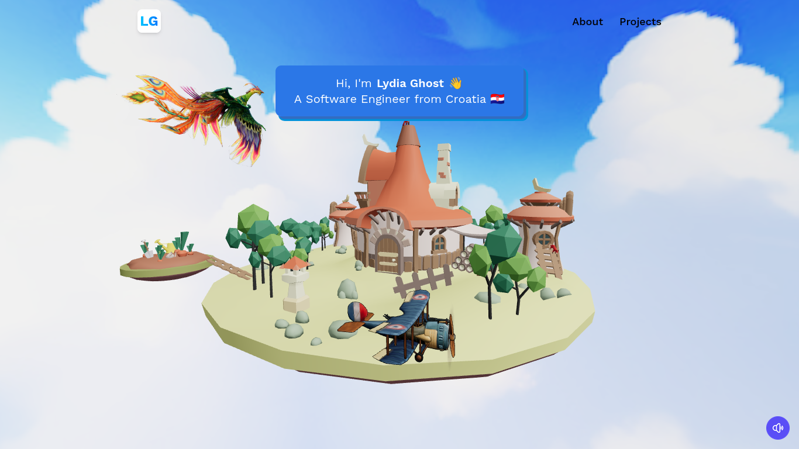

# Lydia — 3D Developer Portfolio


A fully-animated **3D developer portfolio** built using **React 19**, **Three.js with @react-three/fiber**, **TailwindCSS 4**, and **Vite**.
Features immersive 3D scenes, smooth page transitions, and a working EmailJS contact form.

---

## ✨ Overview

**Lydia Portfolio** is a modern personal portfolio designed for developers who want a unique 3D aesthetic combined with clean UI components and fast performance.

You get:

- 🌄 **Interactive 3D hero section** powered by React Three Fiber
- 🐦 3D models like **Island, Bird, Plane, Sky, Fox**
- 🎭 Smooth animations with **React Spring (three)**
- 📩 Working EmailJS-powered contact form
- 🧭 Multi-page routing via **React Router v7**
- 🚀 Ultra-fast bundling using **Vite 7**

---

## 🖥️ Desktop Preview



---

## 📦 Tech Stack

### **Frontend**

- React 19
- React Router v7
- Vite 7
- TailwindCSS 4
- React Spring (Three)
- EmailJS Browser SDK

### **3D & Animation**

- @react-three/fiber
- @react-three/drei
- @react-spring/three

### **Developer Tools**

- ESLint 9
- Prettier 3 + Tailwind Prettier plugin
- SWC React plugin

---

## 🛠️ Getting Started

### 1. Clone the Repository

```bash
git clone https://github.com/mdjunaid-11/lydia_portfolio.git
cd lydia_portfolio
```

### 2. Install Dependencies

```bash
npm install
```

### 3. Create Environment File

Create **`.env`** in the root:

```env
VITE_APP_EMAILJS_SERVICE_ID=your_service_id
VITE_APP_EMAILJS_TEMPLATE_ID=your_template_id
VITE_APP_EMAILJS_PUBLIC_KEY=your_public_key
```

### 4. Start Development Server

```bash
npm run dev
```

---

## 📁 Folder Structure

```bash
.
├── config
│   └── index.js                # Base variables (name, email, baseName)
├── public                      # Icons, manifest, favicons
├── src
│   ├── assets
│   │   ├── 3d                  # GLB models: island, fox, plane, bird, sky
│   │   ├── icons               # Tech & social icons
│   │   ├── images              # Company, hero, meta images
│   │   └── sakura.mp3          # Sound asset
│   ├── components              # Navbar, CTA, Loader, HomeInfo...
│   ├── constants               # skills, projects, experience, social
│   ├── lib                     # helpers
│   ├── models                  # JSX wrappers for GLB 3D models
│   ├── pages                   # Home, About, Projects, Contact
│   ├── App.jsx
│   ├── index.css
│   └── main.jsx
└── vite.config.js
```

---

## 🚀 Features

- 🌐 **3D Hero Experience** using GLTF models
- 🕊️ Animated bird, plane, fox & island environments
- 🎬 Page transitions with spring animations
- 📱 Fully responsive modern UI
- 🧭 Multi-page **React Router 7**
- 🎨 TailwindCSS 4 utility-first styling
- 💌 EmailJS contact integration
- ⚡ Vite-powered fast dev/build

---

## 📬 Contact Form (EmailJS)

Integrated using:

```js
import emailjs from '@emailjs/browser';

emailjs.send(serviceID, templateID, params, publicKey);
```

Configure via `.env` variables shown above.

---

## 📜 Scripts

```json
{
  "dev": "vite",
  "build": "vite build",
  "lint": "eslint .",
  "preview": "vite preview"
}
```

---

## 🪪 License

[](./LICENSE)

This project is open-source under the **MIT License**.

---
